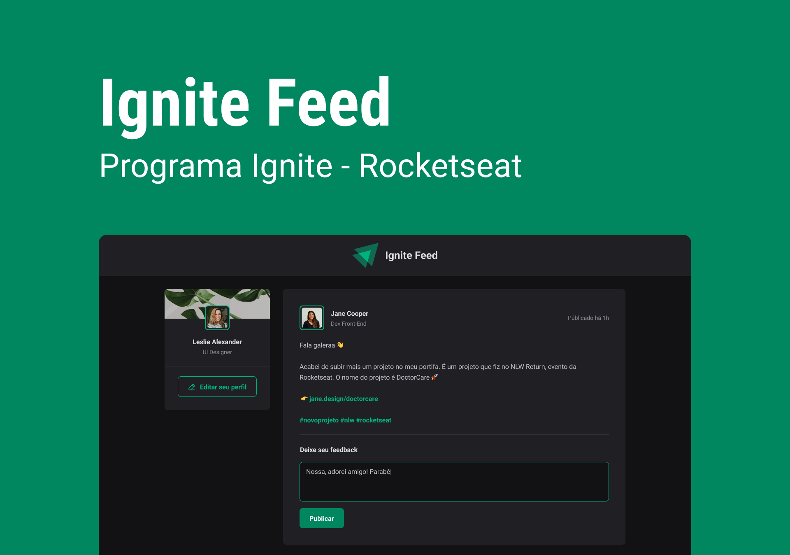

# Ignite Feed

Projeto da trilha ignite ReactJs, projeto para aprender mais sobre os conceitos básicos do React e TypeScript.


#### ✔️ 🚀 Concluido  ✔️




## Tecnologias

Este projeto foi desenvolvido com as seguintes tecnologias:

- React
- TypeScript
- SASS

## Iniciar projeto

Clone o projeto e entre na pasta:

```bash
$ git clone https://github.com/Luis-Felipe-N/ignite-feed.git
$ cd ignite-feed
```


Follow the steps below:
```bash
# Instalação de dependencias
$ yarn ou npm install

# Iniciando projeto
$ yarn dev ou npm run dev
```
Se tudo dé certo, acesse http://localhost:3000/ ou http://localhost:5173/

## Autor
---

Feito com ❤️ por Luis Felipe
